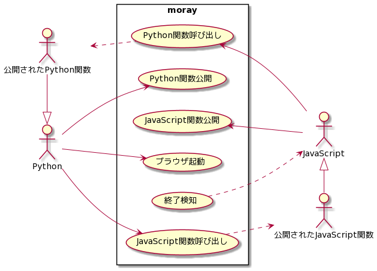
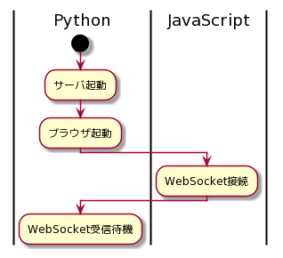
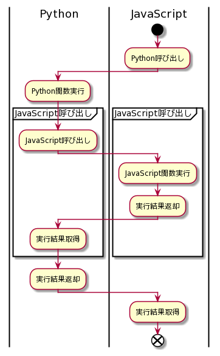
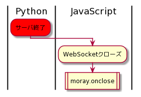

# 基本設計
- 機能一覧とPython・JavaScript間の相互呼び出し

***
## 目次
- [ユースケース図](#ユースケース図)
- [moray起動](#moray起動)
- [Python関数・JavaScript関数呼び出し](#python関数・javascript関数呼び出し)
- [終了検知](#終了検知)

***
## ユースケース図

 
- Python・JavaScript間の双方向呼び出しを行う
  - WebSocketにより実現
- 呼び出せるPython関数は、事前に公開したPython関数のみ
- 呼び出せるJavaScript関数は、事前に公開したJavaScript関数のみ
- ブラウザはアプリモードで起動する
- 不測の事態によりサーバが終了してしまった場合、終了したことをJavaScript側で検知する

***
## moray起動

 
- WebSocketサーバを起動する
- ページ表示時にWebSocketの接続を確立する

***
## Python関数・JavaScript関数呼び出し

 
- PythonからJavaScriptを呼び出せるのは、JavaScriptから呼ばれたPython関数と同一スレッド内のみ

***
## 終了検知

 
- サーバ終了はWebSocketが閉じたことにより検知する
