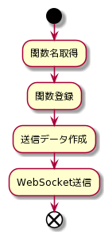
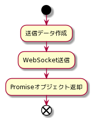
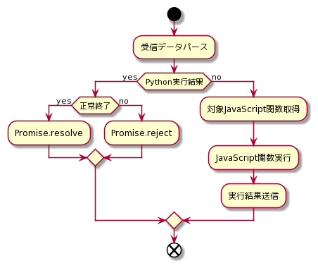

# 詳細設計 JavaScript編
- JavaScript側の詳細設計

***
## 目次
- [JavaScript関数公開](#javascript関数公開)
- [Python関数呼び出し](#python関数呼び出し)
- [WebSocket受信](#websocket受信)

***
## JavaScript関数公開

 

***
## Python関数呼び出し

 
- 公開されたPython関数のみ呼び出し可能
- Promiseオブジェクトにより、実行結果を非同期に取得可能にする

***
## WebSocket受信

 
- 公開したJavaScript関数のみ呼び出し可能
- Promiseオブジェクトを通して実行結果を返却
