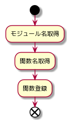
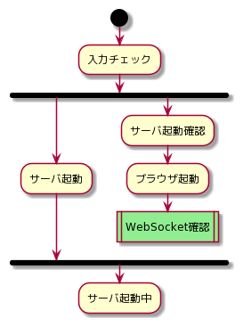
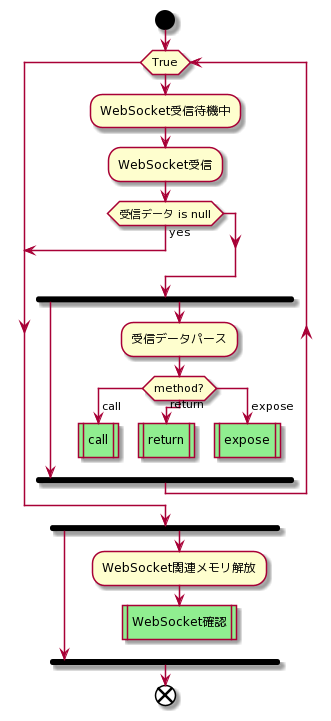
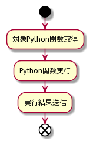
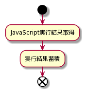
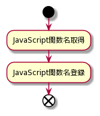
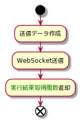
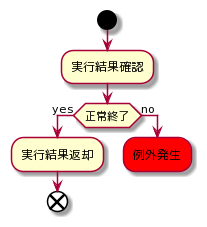
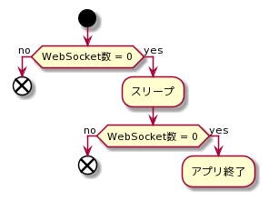

# 詳細設計 Python編
- Python側の詳細設計

***
## 目次
- [Python関数公開](#python関数公開)
- [moray起動](#moray起動)
- [WebSocket受信](#websocket受信)
  - [call](#call)
  - [return](#return)
  - [expose](#expose)
- [JavaScript関数呼び出し](#javascript関数呼び出し)
  - [実行結果取得](#実行結果取得)
- [WebSocket確認](#websocket確認)

***
## Python関数公開

 

***
## moray起動

 
- ブラウザが起動されWebSocket接続が確立すると、WebSocket受信待機中になる

***
## WebSocket受信

 
- 受信後の処理は別スレッド内で行う
- 複数画面に対応するために、WebSocket確認は別スレッド内で行う

### call

 
- 公開したPython関数のみ呼び出し可能

### return

 
- 実行結果を蓄積し、別関数により取得する

### expose

 
- JavaScriptを呼び出し可能にする

***
## JavaScript関数呼び出し

 
- 公開されたJavaScript関数のみ呼び出し可能

### 実行結果取得

 
- 蓄積されたJavaScript実行結果を取得する

***
## WebSocket確認

 
- 画面遷移時もWebSocketが閉じられるため、スリープを挟んで再度WebSocket数を確認する
